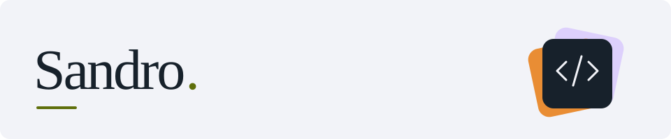

  

  Computer science student at <b>Georgia Tech</b>.  
  <a href="https://sandrokarku.com/">Portfolio</a> &nbsp; · &nbsp;
  <a href="https://www.linkedin.com/in/sandroka/">LinkedIn</a>

### Languages

  

TypeScript · JavaScript · Python · Java · C · C++ · Kotlin · SQL

**Also work with:** React, Next.js, Django, FastAPI, PostgreSQL, and Docker.

### Activities & highlights

- 🏆 **1st place at Ramblin' Hacks**, building Digital Twin with a team of four.
- 🧠 Former **front-end team lead at Synapse X**, Georgia Tech's brain-computer interface organization.
- 💻 Built a campus lost-and-found platform with **Georgia Tech WebDev Club**.

### On the web

- [Confidence Test Prep](https://confidencetestprep.com/) · Adaptive test prep
- [Stela](https://www.stelatime.com/) · Time tracking and organization
- [OLEV](https://www.tryolev.com/) · AI coding compliance
- [Artist Compare](https://artistcompare.com/) · Music artist comparisons
